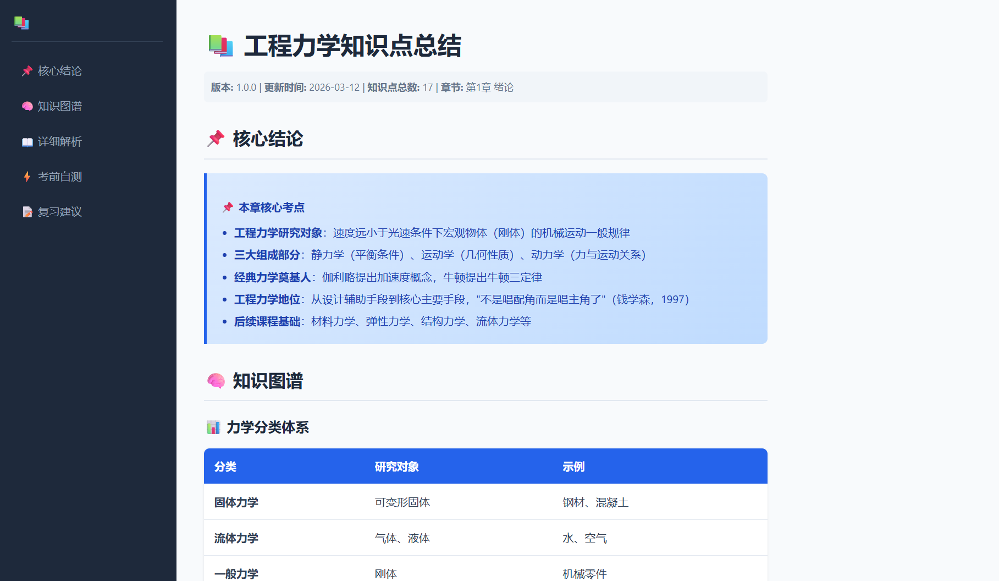
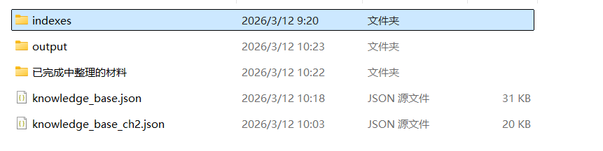

# 学科知识增量积累多 Skill 系统

> 用于构建学科知识增量积累工作流的多 Skill 系统

## 系统架构

本项目包含 **6 个核心 Skills**，形成完整的知识管理解决方案：

```
┌─────────────────────────────────────────────────────────┐
│                    学科知识管理系统                        │
├─────────────────────────────────────────────────────────┤
│  1. scan_directory    │  扫描学科目录，识别文件            │
│  2. parse_multimodal  │  多模态文件解析                    │
│  3. extract_knowledge  │  知识点提取                       │
│  4. merge_knowledge    │  知识融合                         │
│  5. export_formats     │  多格式导出                       │
│  6. build_index        │  检索索引构建                      │
└─────────────────────────────────────────────────────────┘
```

## 🎯 核心功能

### 1. scan_directory - 目录扫描
扫描学科目录，识别所有章节子目录和教学材料文件。

### 2. parse_multimodal - 多模态解析
解析 PDF/PPT/图片文件，提取文本、图像描述、表格内容。

### 3. extract_knowledge - 知识点提取
从解析后的内容中提取知识点，包括概念、定义、公式、例题、定理等。

### 4. merge_knowledge - 知识融合
将新知识点增量合并到现有知识库，处理重复项和冲突。

### 5. export_formats - 多格式导出
将知识库导出为 Markdown、HTML、PDF、思维导图等多种格式。




### 6. build_index - 索引构建
为知识库构建向量索引、关键词索引或混合索引，实现快速 AI 语义搜索。

## 🚀 快速开始

### 安装依赖

```bash
# 核心依赖
pip install openai httpx Pillow

# PDF 解析（可选）
pip install pymupdf

# PPT 解析（可选）
pip install python-pptx

# PDF 导出（可选）
pip install reportlab

# 或安装全部可选依赖
pip install -e ".[all]"
```

### 配置 API

在项目根目录创建 `config.json`：

```json
{
  "api": {
    "base_url": "https://coding.dashscope.aliyuncs.com/v1",
    "api_key": "your-api-key",
    "model": "qwen3.5-plus",
    "vision_model": "qwen3.5-plus",
    "embedding_model": "text-embedding-v3"
  },
  "workflow": {
    "max_retries": 3,
    "retry_delay": 1.0,
    "timeout": 120
  }
}
```

### 运行完整工作流

```bash
python workflow_example.py "./sample_course"
```

## 📊 工作流

```
Agent 检测到新教学资料
        │
        ▼
   scan_directory  ──► 发现新文件列表
        │
        ▼
   parse_multimodal ──► 解析文件内容
        │
        ▼
   extract_knowledge ──► 提取知识点
        │
        ▼
   merge_knowledge ──► 增量合并到知识库
        │
        ▼
   export_formats ──► 导出可用格式
        │
        ▼
   build_index ──► 构建 AI 检索索引
        │
        ▼
   知识系统已更新 ✅
```

## ⚡ 工作流特性

- **错误处理**：每个步骤都有完整的错误捕获和报告
- **状态恢复**：支持从断点恢复，避免重复处理
- **进度追踪**：实时显示处理进度和统计信息

## 🛠️ 依赖技术栈

| 技术 | 说明 |
|------|------|
| LLM | qwen3.5-plus / kimi-k2.5 (通义千问 API) |
| 视觉模型 | qwen3.5-plus (支持多模态) |
| Embedding | text-embedding-v3 |
| PDF 解析 | PyMuPDF |
| PPT 解析 | python-pptx |
| PDF 生成 | reportlab |

## 📁 项目结构

```
knowledge-organizer/
├── SKILL.md                  # 项目总览
├── config.json               # API 配置文件
├── pyproject.toml            # 项目依赖管理
├── workflow_example.py       # 工作流示例
├── common/                   # 共享模块
│   ├── __init__.py
│   ├── config.py             # 配置管理
│   └── api_client.py        # API 客户端
├── scan_directory/
│   ├── SKILL.md
│   └── scripts/scan.py
├── parse_multimodal/
│   ├── SKILL.md
│   └── scripts/parse.py
├── extract_knowledge/
│   ├── SKILL.md
│   └── scripts/extract.py
├── merge_knowledge/
│   ├── SKILL.md
│   └── scripts/merge.py
├── export_formats/
│   ├── SKILL.md
│   └── scripts/export.py
├── build_index/
│   ├── SKILL.md
│   └── scripts/index.py
├── sample_course/            # 示例测试数据
│   ├── 第1章-集合/
│   └── 第2章-函数/
├── md格式展示.png            # 导出效果展示
├── HTML格式展示.png          # 导出效果展示
└── 生成结构展示.png          # 知识库结构展示
```



## 💡 使用场景

- 📚 **教学材料处理**：自动扫描和解析教材、课件
- 🗃️ **知识库构建**：从零开始建立学科知识体系
- 📝 **笔记整理**：将散落的资料整合为结构化知识
- 🔍 **智能检索**：通过向量索引实现语义搜索
- 📤 **多格式导出**：生成 Markdown、HTML 等格式便于分享

## ⚠️ 注意事项

> [!WARNING]
> - API 密钥请妥善保管，不要提交到版本控制
> - 知识点提取和向量索引需要消耗 API 调用额度
> - 处理大量文件时建议分批进行

---

::github{repo="hbt123-123/knowledge-organizer"}
