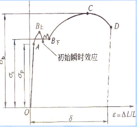

# 土建工程基础 考试重点笔记

> **考试范围**：第1章（工程材料）+ 第2章讲过的部分（基础）+ 第3章（结构与构件设计）
> **复习策略**：以PPT为主，教材为辅 | 理解优先，用自己的语言表达即可 | 简答题写不出来就把题目抄一遍
> **及格线**：50分（本学期标准）

---

# 第1章 工程材料

---

## 1.1 材料的基本性质

---

### 1.1.1 四种密度【重点】

| 类型               | 公式         | 体积含义                              | 适用对象                 |
| ------------------ | ------------ | ------------------------------------- | ------------------------ |
| **实际密度** | ρ = m/V     | 固体本身体积（无任何孔隙）            | 绝对密实材料             |
| **表观密度** | ρa = m/Va   | 含闭口孔隙，不含开口孔隙（Va=V+Vb）   | 多孔块状材料（砖、砌块） |
| **体积密度** | ρ' = m/V'   | 含全部孔隙（开口+闭口）（V'=V+Vb+Vk） | 块状材料                 |
| **堆积密度** | ρ'' = m/V'' | 含颗粒间空隙（V''=V₀+Vk）            | 散粒材料                 |

**实际密度**：V 仅含固体本身体积，无任何孔隙。

**表观密度**：Va = V + Vb（含闭口孔隙，不含开口孔隙）。

**体积密度**：V' = V + Vb + Vk（含全部孔隙：开口+闭口）。

**堆积密度**：V'' = V₀ + Vk（含颗粒间空隙）。

> **密实度**：D = V/V' × 100% = ρ'/ρ × 100%
> **孔隙率**：P = (V'-V)/V' × 100% = (1-ρ'/ρ) × 100%
> **密实度 + 孔隙率 = 1**

---

### 1.1.2 亲水性与憎水性【重点】

- **亲水性**：材料与水接触后被水湿润并吸入内部的性质（水泥、砂石、混凝土）
- **憎水性**：材料与水接触后能将水排斥在外的性质（沥青、石蜡）

> 用自己的语言理解表达即可，不用死记硬背。

---

### 1.1.3 弹性和塑性【重点——会画应力应变图】

- **弹性**：外力作用下产生的形变可随外力消除而完全消失。应力-应变为**直线**关系。
- **塑性**：外力作用下的形变**不随外力消除而消失**，产生永久形变。

> 弹性→释放应力后恢复原状；塑性→释放应力后永久变形（OB距离）。

---

### 1.1.4 力学性质——强度、脆性与韧性【了解】

- **强度**：材料抵抗破坏的能力，按荷载形式分为抗拉、抗压、抗剪、抗弯。公式：P=F/A
  - 水泥、钢筋、混凝土均可按强度划分等级
- **脆性**：无明显变形特征而突然破坏（混凝土、岩石、玻璃）
- **韧性**：能吸收较多能量，产生一定形变而不破坏（钢材、木材）
- **硬度和耐磨性**：硬度大→耐磨性好

---

### 1.1.5 耐久性

材料长久保持原有性质的能力。受物理、化学、生物作用影响。

---

## 1.2 水泥【重点章节】

---

### 1.2.1 硅酸盐水泥的主要成分【必考】

水泥熟料四大矿物组成及分子简式：

| 矿物名称   | 分子简式       | 含量           | 水化速度       | 水化热 | 强度         | 耐化学侵蚀 |
| ---------- | -------------- | -------------- | -------------- | ------ | ------------ | ---------- |
| 硅酸三钙   | **C3S**  | 37~60%（最多） | 较快           | 中等   | 高           | 中等       |
| 硅酸二钙   | **C2S**  | 15~37%         | 慢             | 低     | 早期低后期高 | 良         |
| 铝酸三钙   | **C3A**  | 7~15%          | **最快** | 高     | 低           | 差         |
| 铁铝酸四钙 | **C4AF** | 10~18%         | 中             | 中     | 中（抗折高） | 优         |

> **简式记忆**：C=CaO，S=SiO₂，A=Al₂O₃，F=Fe₂O₃
> 如C3S = 3CaO·SiO₂（硅酸三钙）

**各成分对性能的影响**：

- C3A水化速度最快 → 快硬水泥以铝酸盐为主
- C2S早期强度低但后期增长高，水化热低
- C3S含量最多，强度贡献最大

---

### 1.2.2 水泥的水化反应及产物【必考】

**反应前（反应物）**：水泥熟料矿物（C3S、C2S、C3A、C4AF）+ 水 →
**反应后（水化产物）**：

- **水化硅酸钙（C-S-H）**——最主要的水化产物，提供强度
- **氢氧化钙晶体（Ca(OH)₂）**
- **水化铝酸钙**
- **水化铁酸钙**
- **钙矾石（3CaO·Al₂O₃·3CaSO₄·31H₂O）**——针状晶体，起缓凝作用

> 基本对应关系：C3S、C2S → C-S-H + Ca(OH)₂；C3A + 石膏 → 钙矾石

---

### 1.2.3 凝结时间【重点】

- **初凝时间**：水泥加水起至刚失去塑性 ≥ **45min**
- **终凝时间**：水泥加水起至完全失去塑性 ≤ **6.5h**

---

### 1.2.4 体积安定性【重点】

水泥硬化后体积变化的均匀性。**不安定的原因**：

1. 熟料中游离CaO过多
2. 游离MgO过多
3. 石膏掺量过多

---

### 1.2.5 水泥石的腐蚀【重点——掌握腐蚀机制】

六大腐蚀类型：

| 腐蚀类型     | 机理                           |
| ------------ | ------------------------------ |
| 软水侵蚀     | 溶出Ca(OH)₂，降低碱度         |
| 硫酸盐腐蚀   | 生成石膏、钙矾石→体积膨胀破坏 |
| 镁盐腐蚀     | Mg²⁺与Ca(OH)₂反应           |
| 一般酸的腐蚀 | 中和反应，溶解水泥石           |
| 碳酸腐蚀     | CO₂与水生成碳酸               |
| 强碱腐蚀     | 碱与水泥石成分反应             |

**防腐措施**：合理选用水泥品种、提高密实度、敷设耐蚀保护层。

---

### 1.2.6 影响凝结硬化的因素

加水量（水灰比）、矿物组成、细度、温度与湿度、养护时间。

> 水灰比过大→水分蒸发留下空隙→降低强度；水灰比过小→水化困难。

---

### 1.2.7 常用水泥品种【了解】

| 品种               | 代号       | 特点                           |
| ------------------ | ---------- | ------------------------------ |
| 硅酸盐水泥         | P·I/P·II | 强度高                         |
| 普通硅酸盐水泥     | P·O       | 最常用                         |
| 矿渣硅酸盐水泥     | P·S       | 抗腐蚀强，宜用于水工和海港工程 |
| 火山灰质硅酸盐水泥 | P·P       | 密实度和抗渗性高               |
| 粉煤灰硅酸盐水泥   | P·F       | 干燥收缩小，抗裂性高           |

---

## 1.3 混凝土【重点章节】

---

### 1.3.1 混凝土的组成及各组分作用【重点】

普通混凝土 = **水泥 + 水 + 砂（细骨料）+ 石子（粗骨料）** + 外加剂

| 组分                         | 作用                                                                               |
| ---------------------------- | ---------------------------------------------------------------------------------- |
| 水泥 + 水 → 水泥浆          | **硬化前**：润滑作用，包裹骨料便于施工；**硬化后**：胶结骨料，形成整体 |
| 砂（细骨料）+ 石子（粗骨料） | 骨架和填充作用；硬化后骨料承担约**80%荷载**                                  |

> 只有细骨料无粗骨料 → **水泥砂浆（建筑砂浆）**

---

### 1.3.2 混凝土和易性【重点——三个名词必须记住】

和易性 = **流动性 + 粘聚性 + 保水性** 的综合体现。

| 性质             | 含义                                     |
| ---------------- | ---------------------------------------- |
| **流动性** | 自重或机械振捣下能流动并均匀密实填满模板 |
| **粘聚性** | 组成材料间有粘聚力，不分层不离析         |
| **保水性** | 具有保水能力，不严重泌水                 |

> **水泥砂浆的和易性**：只有流动性和保水性，**没有粘聚性**。

> 三个名词必须准确记忆，其解释理解后用自己的语言表达即可。

---

### 1.3.3 骨料

- **粗骨料**：粒径 > 4.75mm（碎石、砾石）
- **细骨料**：粒径 ≤ 4.75mm（天然砂、人工砂）

---

### 1.3.4 混凝土的强度与耐久性【了解】

- **强度**：以抗压强度为主，用立方体标准试件测定
- **耐久性**：包括抗渗性（Pₙ）、抗冻性（Fₙ）、抗腐蚀性

---

## 1.4 建筑砂浆【了解】

建筑砂浆 = 胶凝材料 + 细骨料 + 水（**无粗骨料**，这是与混凝土的区别）。

和易性：流动性（稠度）+ 保水性（分层度），**无粘聚性**。

---

## 1.5 建筑钢材【重点章节——应力应变图必考】

---

### 1.5.1 钢材生产与分类【重点】

**定义**：含碳量 < 2% 的铁碳合金。

**按脱氧程度分类**（脱氧越好→质量越好）：

> **特殊镇静钢(TZ) > 镇静钢(Z) > 半镇静钢(b) > 沸腾钢(F)**

脱氧不充分 → 残留FeO多 → CO气泡形成微裂缝 → 致密性↓、强度↓、可焊性↓、低温韧性↓

---

### 1.5.2 钢材的显微组织【了解】

| 组织          | 特性                                               |
| ------------- | -------------------------------------------------- |
| 铁素体        | 塑性韧性好，强度硬度低                             |
| 渗碳体(Fe₃C) | 硬脆，塑性韧性几乎为零                             |
| 珠光体        | 铁素体+渗碳体混合物，含碳量0.77%，性质介于二者之间 |

---

### 1.5.3 钢筋的应力-应变曲线 【最最重要！必考！】

**四个阶段（必须能自己画出来并描述每个阶段特点）**：

| 阶段           | 名称               | 特点                                                                                           |
| -------------- | ------------------ | ---------------------------------------------------------------------------------------------- |
| **O→a** | **弹性阶段** | 应力与应变成正比（直线），释放应力后完全恢复。钢筋弹性形变空间很小，斜率很陡                   |
| **a→b** | **屈服阶段** | 应力基本不变而应变持续增加（出现屈服平台/流幅）。保持屈服应力即可持续发生形变                  |
| **b→c** | **强化阶段** | 要继续产生形变必须额外增加应力。在此阶段任一点释放应力再加载，屈服强度会提高（冷加工强化原理） |
| **c→d** | **颈缩阶段** | 某一截面开始紧缩，截面面积减小→所需应力下降→直至拉断                                         |

> **为什么强化阶段能提高屈服强度？** 在b→c阶段任一点释放应力后，钢筋有固定形变。再次拉伸时屈服强度提升，但屈服到颈缩的幅度减小（强屈比变化）。

### 1.5.4 冷加工强化【重点】

冷加工 = 在常温下以**超过屈服点但不超过抗拉强度**的应力对钢材加工，产生塑性变形来提高屈服强度。

| 方式           | 效果                                                                      |
| -------------- | ------------------------------------------------------------------------- |
| **冷拉** | 屈服点提高**20%~25%**                                               |
| **冷拔** | 屈服点提高**40%~60%**（同时受拉和挤压，效果更显著），但塑性韧性降低 |

> **机理**：必须在强化阶段（b→c区间）进行加工，既改变形状又提高屈服强度。

---

### 1.5.5 碳素结构钢牌号【重点】

牌号 = Q（屈服点字母）+ 屈服点数值(MPa) + 质量等级(A/B/C/D) + 脱氧方法(F/b/Z/TZ)

| 牌号           | 屈服点(MPa)             |
| -------------- | ----------------------- |
| Q195           | 195                     |
| Q215           | 215                     |
| **Q235** | **235（最常用）** |
| Q255           | 255                     |
| Q275           | 275                     |

> 例：**Q235-A·F** = 屈服点≥235MPa的A级沸腾钢

---

### 1.5.6 屈强比与强屈比【了解】

- **屈强比**（σs/σb）：屈强比小→安全性高；屈强比过大→钢材利用率低
- **强屈比**（σb/σs）：抗震结构要求强屈比 ≥ **1.25**；一般结构 ≥ 1.2
- 有抗震要求的框架结构纵向受力钢筋，屈强比不应超过 **0.80**

---

### 1.5.7 钢材的腐蚀与防腐【了解】

- **化学腐蚀**：与O₂、SO₂等直接反应（无电流）
- **电化学腐蚀**：潮湿环境中形成微电池（最主要形式）
- **防腐**：耐候钢、金属覆盖（镀锌）、非金属覆盖、阴极保护

---

## 1.6 沥青防水材料【重点】

---

### 1.6.1 沥青的组分【重点——三组分分析法】

| 组分               | 外观特征         | 平均分子量 | 碳氢比  | 含量/% | 物化特征                                                                         |
| ------------------ | ---------------- | ---------- | ------- | ------ | -------------------------------------------------------------------------------- |
| **油分**     | 淡黄透明液体     | 200~700    | 0.5~0.7 | 45~60  | 几乎可溶于大部分有机溶剂，加热挥发，影响沥青的**流动性**、抗裂性及施工难度 |
| **树脂**     | 红褐色粘稠半固体 | 800~1000   | 0.7~0.8 | 15~30  | 温度敏感性高，赋予沥青**塑性**、粘结性、可乳化性                           |
| **地沥青质** | 深褐色固体微粒   | 1000~5000  | 0.8~1.0 | 5~30   | 加热不熔化，分解为硬焦炭，决定沥青的**粘结力**、**温度稳定性**       |

---

### 1.6.2 针入度实验【重点】

以特定质量的标准针扎入沥青，测量扎入深度：

- 越**软**→针入度越大→软化点越**低**
- 越**硬**→针入度越小→软化点越**高**

**沥青牌号**（号数越小越硬）：

| 牌号 | 针入度(0.1mm) | 软化点(℃) |
| ---- | ------------- | ---------- |
| 10号 | 10~25         | ≥95       |
| 30号 | 26~35         | ≥75       |
| 40号 | 36~50         | ≥60       |

---

### 1.6.3 沥青选用原则【重点】

**屋面用沥青的软化点应比本地区屋面可能达到的最高温度高 20~25℃。**

- 南方炎热地区 → 选软化点较高的沥青（避免夏季流淌）
- 严寒地区 → 选延伸度较大的沥青（避免脆裂）

---

### 1.6.4 石油沥青的三大技术指标【了解】

| 指标   | 反映性质       |
| ------ | -------------- |
| 针入度 | 粘滞性（稠度） |
| 延度   | 塑性           |
| 软化点 | 温度敏感性     |

---

# 第2章 建筑物与构筑物的构造（仅基础部分）

> 老师明确：第二章自学部分不考，只考课堂上讲过的"基础"相关内容。

---

## 2.1 地基与基础【重点——区分清楚】

- **基础**：建筑物上部承重结构向下的延伸和扩大，承受并传递全部荷载到地基，**是建筑物的组成部分**
- **地基**：承受由基础传来荷载的土层，**不是建筑物的组成部分**

> 每年都有人搞混！

---

## 2.2 桩基【重点】

**适用场景**：荷载大、层数多、高度高、地基土松软时采用。

### 按传力方式分类：

| 类型             | 原理                                           | 适用                   |
| ---------------- | ---------------------------------------------- | ---------------------- |
| **端承桩** | 桩端直接支承在岩石或硬土层上，通过桩端传递荷载 | 坚硬土层较浅、荷载较大 |
| **摩擦桩** | 靠桩壁与土壤的摩擦力承担总荷载                 | 坚硬土层较深、荷载较小 |

> 两者都是在软土层中承载力不够时使用的基础形式。

---

## 2.3 基础的埋置深度【重点】

**定义**：室外设计地面到基础底面的距离。

- **≤5m**：浅基础（优先选择）
- **≥5m**：深基础
- 最小埋置深度不应小于 **500mm**（防冻胀、防人为破坏、防冲刷）

### 影响埋深的主要因素【重点】：

1. **建筑物特点**：高层建筑埋深约为地上高度的 **1/10~1/14**
2. **地下水位**：基础底面距最高地下水位 ≥ 0.5m（黏性土）或 ≥ 1.0m（砂土）
3. **冻土深度**：基础应埋置在**冰冻线以下200mm**处（防止冻胀引起不均匀沉降）
4. **相邻建筑**：新建房屋埋深大于原有房屋时须采取措施（支护、安全间距、护坡桩）

---

## 2.4 基础的形式【了解】

| 基础类型 | 适用条件             |
| -------- | -------------------- |
| 条形基础 | 砌体结构墙下         |
| 独立基础 | 框架结构柱距较大     |
| 筏形基础 | 地基弱、荷载大       |
| 井格基础 | 地基差、提高整体刚度 |
| 箱形基础 | 地基差、沉降要求严   |

### 刚性基础与柔性基础【了解】

- **刚性基础**（砖、石、素混凝土）：受**刚性角**限制
- **柔性基础**（钢筋混凝土）：基础宽度不受刚性角限制

---

# 第3章 结构与构件设计【重点章节——计算题出题来源】

---

## 3.1 基本概念

---

### 3.1.1 支座类型【重点】

| 类型       | 垂直方向 | 水平方向 | 转动     |
| ---------- | -------- | -------- | -------- |
| 可动铰支座 | 不能移动 | 可移动   | 可以转动 |
| 固定铰支座 | 不能移动 | 不能移动 | 可以转动 |
| 固定支座   | 不能移动 | 不能移动 | 不能转动 |

---

### 3.1.2 荷载分类【重点】

| 类型                       | 定义                       | 举例                         |
| -------------------------- | -------------------------- | ---------------------------- |
| **永久荷载（恒载）** | 使用期间不随时间变化       | 构件自重、土压力、水压力     |
| **可变荷载（活载）** | 使用期间随时间变化         | 屋面活荷载、雪荷载、吊车荷载 |
| **偶然荷载**         | 不一定出现但一旦出现值很大 | 爆炸、撞击、地震             |

---

### 3.1.3 极限状态的定义与分类【重点】

**极限状态**：结构构件由可靠转向失效的临界状态。

| 类别                       | 标志                                           |
| -------------------------- | ---------------------------------------------- |
| **承载力极限状态**   | 失去平衡、达到最大承载力、疲劳破坏、压屈失稳等 |
| **正常使用极限状态** | 过大变形、过大裂缝、过大振动等                 |

> 关键区分：承载力极限状态关乎**安全（会不会塌）**；正常使用极限状态关乎**使用性能（能不能用）**。

---

### 3.1.4 截面受力形态【重点】

基本受力形态：受拉、受压、受弯、受剪、受扭。

**核心理解**：在简支梁承受集中荷载时，**中和轴**以上为受压区，以下为受拉区。

- 受拉区主要由**钢筋**承担拉力（混凝土抗拉强度远小于钢筋）
- 受压区主要由**混凝土**承担压力（混凝土抗压性能远高于抗拉性能）

---

## 3.2 受弯构件正截面承载力计算【重点——计算题核心】

---

### 3.2.1 正截面与斜截面破坏【重点】

- **正截面**：与构件纵轴垂直的截面，裂缝呈**竖直方向**（纯弯段P-P之间）
- **斜截面**：弯剪段产生的**斜裂缝**

---

### 3.2.2 适筋梁、超筋梁、少筋梁【重中之重！】

| 类型             | 配筋情况 | 破坏特征与过程                                                                             | 破坏性质                   |
| ---------------- | -------- | ------------------------------------------------------------------------------------------ | -------------------------- |
| **适筋梁** | 配筋适量 | 受拉区混凝土先开裂→裂缝发展→受拉钢筋**屈服**→裂缝不断向上发展→受压区混凝土被压碎 | **延性破坏**（允许） |
| **超筋梁** | 配筋过多 | 受压区混凝土先被压碎，此时受拉钢筋**未屈服**                                         | **脆性破坏**（避免） |
| **少筋梁** | 配筋过少 | 一开裂钢筋即被拉断                                                                         | **脆性破坏**（避免） |

> **只有适筋梁是延性破坏，超筋梁和少筋梁都是脆性破坏！**

**为什么适筋梁是延性破坏？**

- 钢筋达到屈服后产生持续的大变形（流幅），裂缝不断发展、中和轴上移
- 受压区混凝土逐步被压缩，过程持续一定时间
- 裂缝发展肉眼可见，给人逃生反应时间

**为什么超筋梁是脆性破坏？**

- 钢筋配得太多，每根钢筋受力不足，无法屈服
- 受压区混凝土先被压碎→瞬间失效→无预兆

**为什么少筋梁是脆性破坏？**

- 配筋太少，相当于素混凝土梁
- 一出现裂缝钢筋即断，无任何预兆

---

### 3.2.3 适筋梁正截面受弯的三个阶段【重点——结合教材P148-149】

| 阶段                             | 特点                                             | 设计意义                           |
| -------------------------------- | ------------------------------------------------ | ---------------------------------- |
| **第I阶段（未裂阶段）**    | 全截面参加受力，弯矩与曲率近似正比               | 抗裂计算的依据                     |
| **第II阶段（带裂缝工作）** | 受拉区混凝土退出工作，钢筋承担拉力；抗弯刚度降低 | 裂缝宽度和变形验算的依据           |
| **第III阶段（破坏阶段）**  | 受拉钢筋屈服→受压区混凝土被压碎→构件完全破坏   | **承载力极限状态计算的依据** |

> 教材P148~149（图3.41），重点阅读，理解应力应变变化过程！

---

### 3.2.4 等效矩形应力图【重点】

将受压区混凝土的实际抛物线应力分布等效为矩形，两个原则：

1. **合力大小相等**
2. **合力作用点不变**

| 混凝土强度等级 | α（强度修正） | β（高度修正） |
| :------------: | :------------: | :------------: |
|     ≤C50     |      1.0      |      0.8      |

> 一般取 α=1.0，C55以下均适用。

---

### 3.2.5 单筋矩形截面正截面承载力基本方程【必考——计算题基础】

**（1）力的平衡方程**：

$$
∑N = 0：\quad αf_c \cdot b \cdot x = f_y \cdot A_s
$$

（受压区混凝土合力 = 受拉钢筋拉力）

**（2）力矩平衡方程**：

$$
M_u = αf_c \cdot b \cdot x \cdot (h_0 - \frac{x}{2})
$$

（极限弯矩 = 压力的合力 × 内力臂）

其中：

- `b`——截面宽度
- `x`——混凝土受压区高度（等效矩形高度）
- `h₀`——截面有效高度，**h₀ = h - aₛ**
- `f_c`——混凝土轴心抗压强度设计值
- `f_y`——钢筋**屈服强度**（极限状态下 σₛ = f_y）
- `A_s`——受拉钢筋截面面积
- `M_u`——极限弯矩

> **两个方程必须掌握，所有计算题的基础！即使什么题都不会做，把这两个公式写下来也有分。**

---

### 3.2.6 配筋率与最大/最小配筋率验算【重点】

**配筋率**：

$$
\rho = \frac{A_s}{b \cdot h_0}
$$

**相对受压区高度**：

$$
\xi = \frac{x}{h_0} = \rho \cdot \frac{f_y}{αf_c}
$$

---

### 防超筋破坏（最大配筋率验算）：

$$
x \leq \xi_b \cdot h_0 \quad \text{或} \quad \xi \leq \xi_b
$$

其中 ξb 为界限相对受压区高度（查表得，如C30取0.55）。

> 判别方法：计算得到的 x 与 ξb·h₀ 比较，超过即为超筋。

---

### 防少筋破坏（最小配筋率验算）：

$$
\rho_{min} = \frac{45f_t}{f_y}\%
$$

**判别条件**：A_s ≥ ρ_min · b · h

> **为什么用 ft（混凝土抗拉强度）？** 少筋破坏的本质是混凝土抗拉不足即开裂→钢筋瞬间断裂，所以用混凝土抗拉强度表征临界状态。

> **为什么是45ft/fy？** 确保混凝土开裂瞬间钢筋能稳稳屈服而不断裂，0.45是经验系数。

---

### 3.2.7 单筋矩形截面计算例题【会算】

**例题**：已知 b=250mm, h=500mm, as=35mm, M=150kN·m, C30(fc=14.3, ξb=0.55, ft=1.43), fy=465MPa。求As和配筋率ρ。

**解题步骤**：

1. h₀ = h - as = 500 - 35 = **465mm**
2. 由力矩平衡方程解 x：

   $$
   150×10^6 = 1.0 × 14.3 × 250 × x × (465 - x/2)
   $$

   → x = **101.26mm**
3. 验算超筋：x=101.26 < ξb·h₀=0.55×465=255.75 ✓（不超筋）
4. 由力的平衡求As：

   $$
   A_s = \frac{αf_c·b·x}{f_y} = \frac{1.0×14.3×250×101.26}{465} = 778.50mm²
   $$
5. ρ = As/(b·h₀) = 778.50/(250×465) = **0.67%**
6. 验算少筋：ρmin = 45×1.43/465% = 0.138%，ρ=0.67% > 0.138% ✓（不少筋）

> 结论：在合适区间内，该梁按**适筋梁**设计 ✓

---

### 3.2.8 安全验算例题【会算】

**例题**：已知 b=250, h=450, as=35, C40(fc=19.1, ft=1.71), 4根φ16 HRB300(fy=300), M=89kN·m, 验算是否安全。

**步骤**：

1. h₀ = 415mm，As = 4×π×8² = **804mm²**
2. 力的平衡求x：x = As·fy/(b·fc) = 804×300/(250×19.1) = **50.51mm**
3. 验算超筋：50.51 < 0.55×415=228.25 ✓
4. Mu = fc·b·x·(h₀-0.5x) = 19.1×250×50.51×(415-25.255) = **94.00kN·m**
5. Mu=94.00 > M=89 → **安全 ✓**

---

## 3.3 双筋矩形截面【重点】

在受压区也配置钢筋（As'），基本原理与单筋相同：

**力的平衡（多了受压钢筋项）**：

$$
αf_c·b·x + f_y'·A_s' = f_y·A_s
$$

**力矩平衡**：

$$
M_u = αf_c·b·x·(h_0 - \frac{x}{2}) + f_y'·A_s'·(h_0 - a_s')
$$

> 注意：受拉钢筋与受压钢筋的屈服强度 fy 相同（同一型号），但配筋面积不同（As' < As）。

> 受压区钢筋多了一个"帮手"，如果 As' 接近或大于 As 则类似超筋或反过来了。

---

## 3.4 T形截面【重点】

---

### 3.4.1 T形截面的分类

根据受压区高度 x 与翼缘高度 hf' 的关系分为两种情况：

**判别方法**（比较钢筋"能提供的"与翼缘"能承受的"）：

- **第一种类型**（x ≤ hf'）：按**矩形截面**计算（宽度取 bf'）

  > 判别条件：fy·As ≤ αfc·bf'·hf'（实际的力 ≤ 翼缘能提供的最大力）
  >
- **第二种类型**（x > hf'）：按**T形截面**计算（需要在翼缘下面补一块矩形面积来平衡）

> 核心理解：假设以翼缘边界为整体计算受压区能提供的压力，如果实际需要的压力 ≤ 这个值 → 矩形截面（第一类）；如果＞ → 需要在腹板继续补面积 → T形截面（第二类）。

> 教材P166，3.4.4，务必对照教材阅读！

---

### 3.4.2 T形截面计算要点

**第一类（x ≤ hf'）**：按 bf'×h 的矩形截面计算，方法与单筋矩形截面完全一样。

**第二类（x > hf'）**：力的平衡：

$$
αf_c·b·x + αf_c·(b_f' - b)·h_f' = f_y·A_s
$$

> 计算题与单筋类似，关键是先判断属于哪一类。

---

## 3.5 受压构件【重点】

---

### 3.5.1 偏心受压基本概念

受压构件天然存在偏心（很难搭在正中心）。根据偏心距大小分为：

| 类型                 | 截面受力状态                         | 破坏形式                           |
| -------------------- | ------------------------------------ | ---------------------------------- |
| **大偏心受压** | 一侧受拉、一侧受压                   | **延性破坏**（与适筋梁类似） |
| **小偏心受压** | 全截面受压或部分受拉受压，但整体偏压 | **脆性破坏**（与小偏心类似） |

> **大偏心破坏 = 适筋梁破坏**：受拉钢筋先屈服→受压区混凝土被压碎，两个材料都充分利用，有明显预兆。
>
> **小偏心破坏**：混凝土被压碎→瞬间失效→无逃生空间，属于**脆性破坏**，设计中应尽量避免。

---

### 3.5.2 偏心距计算【重点】

- **e₀ = M/N**（轴向力对重心的偏心距）
- **e_i = e₀ + e_a**（初始偏心距，e_a为附加偏心距，一般可忽略）
- **e = e_i + h/2 - a_s**（轴向力到受拉钢筋合力点的距离）

> 通过 e 将设计弯矩 M 转化为力矩平衡方程中能用的力臂。

---

### 3.5.3 大偏心受压构件平衡方程

**力的平衡**：

$$
N = αf_c·b·x + f_y'·A_s' - f_y·A_s
$$

**力矩平衡**：

$$
N·e = αf_c·b·x·(h_0 - \frac{x}{2}) + f_y'·A_s'·(h_0 - a_s')
$$

> 注意：大偏心中 σₛ = f_y（受拉钢筋屈服）；小偏心中 σₛ < f_y（未屈服）。

---

### 3.5.4 大、小偏心的关键区别

| 对比维度   | 大偏心             | 小偏心          |
| ---------- | ------------------ | --------------- |
| 受拉钢筋   | 屈服（σₛ = f_y） | 未屈服          |
| 破坏性质   | 延性破坏           | 脆性破坏        |
| 设计态度   | 可以采用           | 尽量避免        |
| 与梁的类比 | 类似适筋梁         | 类似超筋/少筋梁 |

---

## 附录：考试答题技巧

1. **简答/论述题写不出来**：把题目抄一遍，不能空着
2. **计算题**：把力的平衡和力矩平衡两个基本方程写下来就有分
3. **应力应变图**：自己动手画一遍，边画边想每个阶段的特点
4. **计算器**：记得带上
5. **及格线50分**，本学期标准

---

> **复习优先级**：钢筋应力应变图 > 适筋梁三阶段 > 单筋计算 > 水泥成分/水化产物 > 沥青选用原则 > 基础/地基区别 > 混凝土和易性
